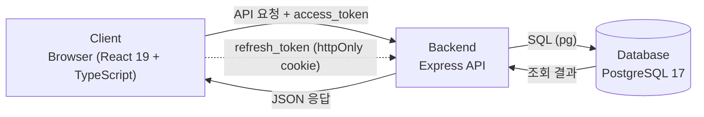
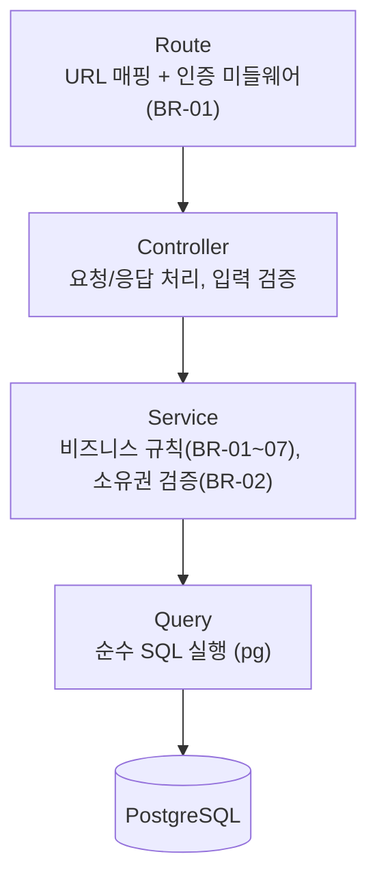
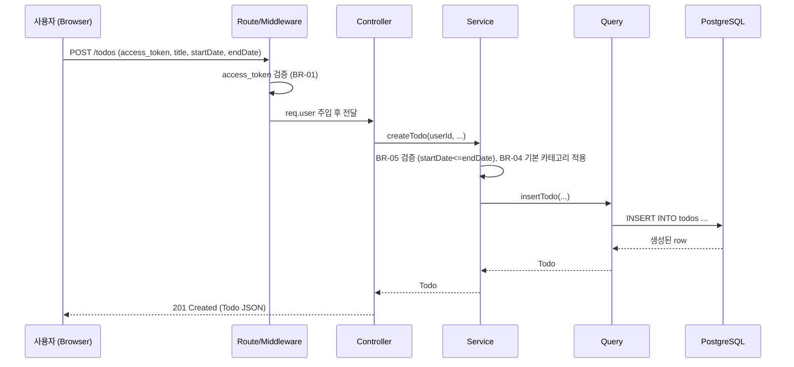

# TodoList 아키텍처 다이어그램 (Architecture Diagram)

## 버전 이력

| 버전  | 날짜       | 작성자     | 변경 내용     |
| ----- | ---------- | ---------- | -------------- |
| 0.1.0 | 2026-08-26 | Daniel Kim | 최초 초안 작성 |

---

## 1. 문서 개요

**목적**: `1-domain-definition.md`(v0.4.0), `2-PRD.md`(v0.2.0), `5-project-principle.md`(v0.2.0)에서 정한 도메인·요구사항·구조 원칙을 시스템 전체 관점에서 한눈에 파악할 수 있도록 아키텍처 다이어그램으로 정리한다.

**관련 문서**:

- `1-domain-definition.md`: 도메인 용어, 엔티티, 비즈니스 규칙(BR-01~07)
- `2-PRD.md`: 기술 스택, 인증 방식(JWT), 비기능 요구사항
- `5-project-principle.md`: FSD 프론트엔드 구조, 백엔드 Route-Controller-Service-Query 구조

**범위**: 1인 개발·2일 일정 MVP 기준. 단일 서버/인스턴스를 전제로 하며, 로드밸런서·마이크로서비스 등 배포 인프라 세부사항은 다루지 않는다.

---

## 2. 전체 시스템 구성도

- 인증: access_token은 요청 헤더로 전달, refresh_token은 httpOnly 쿠키로 재발급 시에만 사용 (PRD 7장)
- 단일 Express 서버가 API·인증을 모두 처리하며, 별도 인증 서버/게이트웨이는 두지 않는다.

---

## 3. 백엔드 레이어 구조도

- 컨트롤러는 SQL을 직접 작성하지 않고, 쿼리 계층만 DB에 접근한다 (5-project-principle.md 2.2절).

---

## 4. 데이터 흐름 예시: 할일 등록 (UC-04)

---

## 5. 다이어그램 미포함 사항

- FSD 슬라이스별 세부 파일 구조 (5-project-principle.md 6장 참조)
- DB 테이블 컬럼 상세 (1-domain-definition.md 3장 참조)
- 로드밸런서, 캐시(Redis), 컨테이너 오케스트레이션 등 배포 인프라 — 2일/1인 개발 규모상 이번 범위에서 다루지 않는다.
