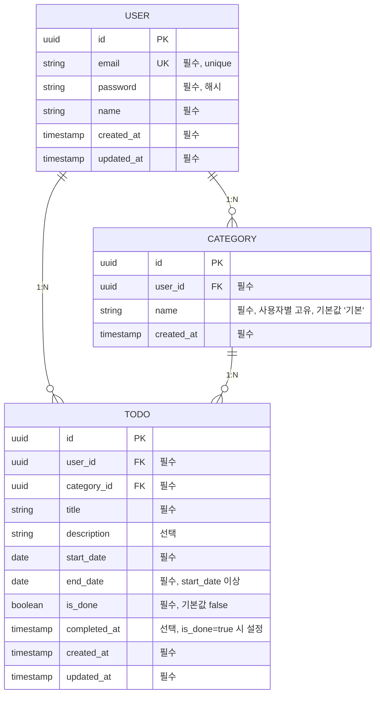

# TodoList ERD (Entity Relationship Diagram)

## 버전 이력

| 버전  | 날짜       | 작성자     | 변경 내용     |
| ----- | ---------- | ---------- | -------------- |
| 0.1.0 | 2026-08-26 | Daniel Kim | 최초 초안 작성 |
| 0.1.1 | 2026-08-26 | Daniel Kim | schema_migrations(도구용 메타데이터) 각주 추가 |

---

## 1. 문서 개요

**목적**: `1-domain-definition.md`(v0.4.0) 3장(핵심 도메인 엔티티 및 속성)·4장(엔티티 관계)에 정의된 User/Category/Todo 모델을 PostgreSQL 17 테이블 구조로 시각화한다.

**참조**: 컬럼 목록·필수 여부는 도메인정의서 3장, 관계(1:N)는 4장을 그대로 따른다. 컬럼명은 `5-project-principle.md` 3.1절 규칙에 따라 snake_case로 표기한다.

---

## 2. ERD

> 상태(시작 전/진행중/완료/지연)는 별도 컬럼이 아니라 `start_date`, `end_date`, `is_done`으로부터 조회 시점에 계산되는 값이며 테이블에 존재하지 않는다 (BR-06).

---

## 3. 테이블별 제약사항 요약

**users**
- `email` UNIQUE, 동일 email 중복 가입 불가 (BR-03)

**categories**
- `user_id` FK → users.id
- `(user_id, name)` 사용자별 고유 (도메인정의서 3.2)
- '기본' 카테고리는 사용자별 최초 1회 자동 생성, 삭제 불가 (BR-04)

**todos**
- `user_id` FK → users.id, `category_id` FK → categories.id, 둘 다 NOT NULL
- `category_id` 미지정 시 해당 사용자의 '기본' 카테고리로 자동 대체되어 항상 값을 가짐 (BR-04)
- `end_date >= start_date` (BR-05)
- `is_done=true` 전환 시 `completed_at` 기록, 취소 시 초기화 (BR-07)
- 소유권 검증: 모든 조회/수정/삭제는 `user_id` 조건으로 본인 데이터만 접근 (BR-02)

---

## 4. 참고: 인덱스 대상 컬럼

`5-project-principle.md` 5.4절 기준, 목록/필터링(UC-05/06) 성능을 위해 `todos.user_id`, `todos.category_id`, `todos.(start_date, end_date)`에 인덱스를 건다. 구체적인 인덱스 정의는 마이그레이션 파일에서 다룬다.

## 5. 참고: 도구용 메타데이터 테이블

`schema_migrations`(filename, applied_at) 테이블은 `backend/src/db/migrate.js`(DB-03)가 적용된 마이그레이션을 추적하기 위해 자동 생성하는 도구용 테이블이며, 도메인 모델(2장 ERD)에 포함되지 않는다.
